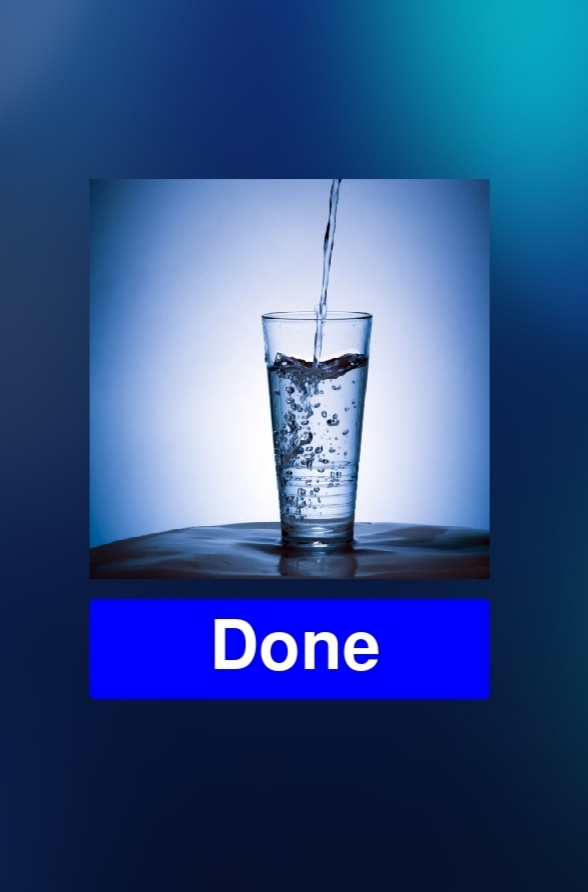

## Healthy_Programmer

# Purpose
We are Programmers. We programmers are hard workers. We work everyday on computer. This harm our eyes and For Any Person like Me who wear glasses It's harm our eyes too much. We always sit on chair. This harm pur back.
To safe from these things and to be healthy everytime. We need to do 3 things:- 1. Drink Water. 2. Eye Exercise. 3. Exercise. 

# Working
This Program will notify You to Drink Aater After every 20 minutes. Do Eye Exercise after every 30 minutes. Do exercise After Every 45 minutes. You can change It in program. This is defined in first line for program.

Modules- Pygame and Time

Idea by Code with Harry

# Special Features

This is Full GUI(Graphical User Interface) based Program. 
This best for programmers.

# Requirements

#### Main file- healthy_programmer.py
1. background.jpg
2. eye.jpg
3. water.jpg
4. exercise.jpg
5. eye.mp3
6. water.mp3
7. exercise.mp3

# Contributers
 
### Add Your name after improving this program
### There are 0 contributers till now.

# Notes

I haven't checked this program Fully So If You get any Error then just make pull request or issue.
This program is lagging sometimes.
I found One error that It log so many data in File. It's not bug or error This is only due to lagging of program. If you have any Idea to solve this then make pull request. Plz

### Screenshot

## Made by Ankit Singh
